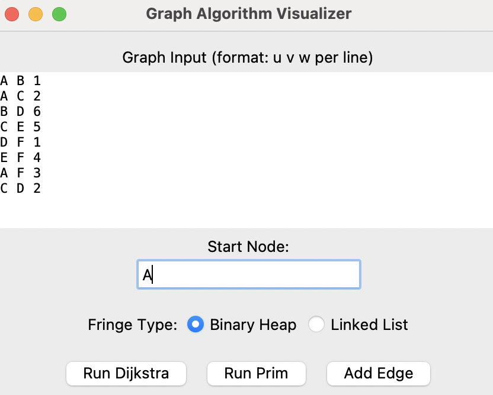
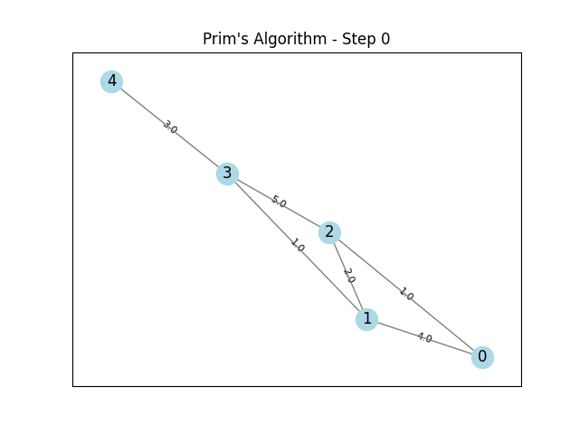
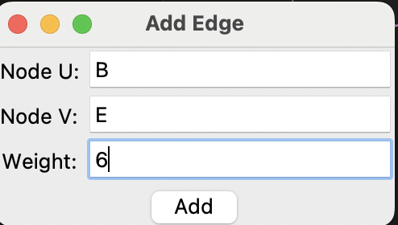
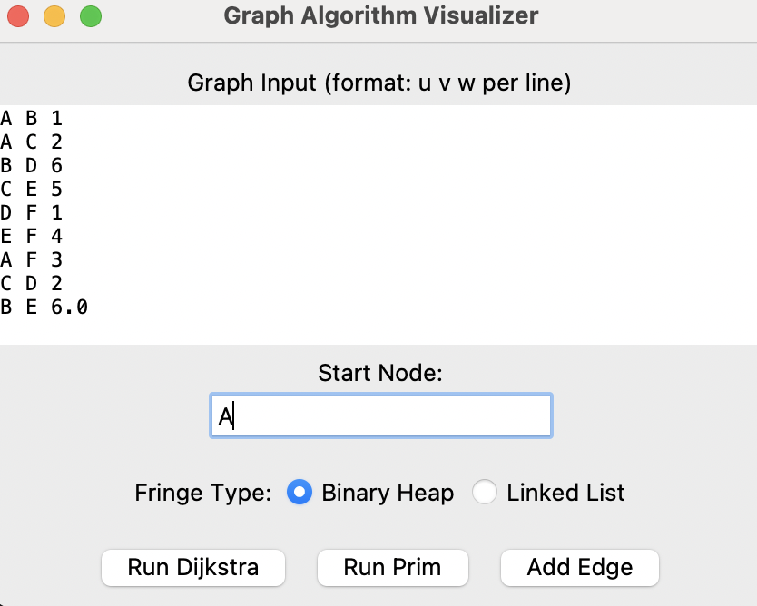

# Graph Algorithms Visualizer 🎯

This project is a visual interactive tool built with Python and Tkinter to demonstrate two fundamental graph algorithms:

- **Dijkstra's Shortest Path Algorithm**
- **Prim's Minimum Spanning Tree Algorithm**

Each algorithm's process is animated and saved as a `.gif` file for better understanding and step-by-step visualization.

---
Install dependencies (if using virtual environment):

pip install -r requirements.txt

---
Run the application:

python main.py

> 📁 **Note:** By default, all generated animation `.gif` files will be saved to:
>
> `Dijkatra&Prim/animation/`
>
> You can modify the path by changing the `SAVE_DIR` variable at the top of `main.py`.

## 🧠 Features

- ✅ Input custom weighted undirected graphs using adjacency list format.
- ✅ Visualize Dijkstra and Prim step-by-step as animated `.gif` files.
- ✅ Save each animation with auto-incrementing filenames.
- ✅ GUI built with Tkinter for:
  - Inputting graph edges
  - Selecting a start node
  - Choosing fringe type (Binary Heap or Linked List)
  - Incrementally adding edges
- ✅ Automatically display the animation result in a popup window.
- ✅ Support for both binary heap and linked list fringe implementations.

---
Enter the graph edges in the format:

Start node:A

A B 1

A C 2

B D 6

C E 5

D F 1

E F 4

A F 3

C D 2

---

## 🎬 Sample Output

| Dijkstra | Prim |
|----------|------|
|  |  |

And add  the edge:

B E 6

|||

## 🎬 Sample Output

| Dijkstra | Prim |
|----------|------|
|  |  |

