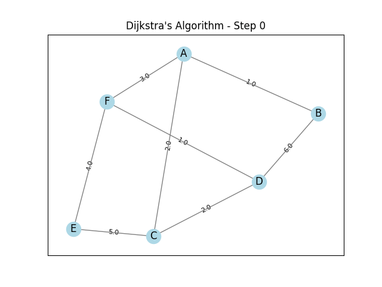
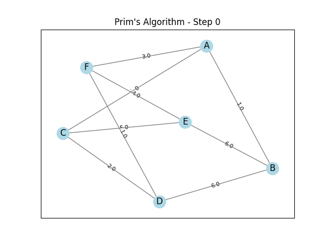

# Graph Algorithms Visualizer 🎯

This project is a visual interactive tool built with Python and Tkinter to demonstrate two fundamental graph algorithms:

- **Dijkstra's Shortest Path Algorithm**
- **Prim's Minimum Spanning Tree Algorithm**

Each algorithm's process is animated and saved as a `.gif` file for better understanding and step-by-step visualization.

---

## 🧠 Features

- ✅ Input custom weighted undirected graphs using adjacency list format.
- ✅ Visualize Dijkstra and Prim step-by-step as animated `.gif` files.
- ✅ Save each animation with auto-incrementing filenames.
- ✅ GUI built with Tkinter for:
  - Inputting graph edges
  - Selecting a start node
  - Choosing fringe type (Binary Heap or Linked List)
  - Incrementally adding edges
- ✅ Automatically display the animation result in a popup window.
- ✅ Support for both binary heap and linked list fringe implementations.

---

## 🎬 Sample Output

| Dijkstra | Prim |
|----------|------|
|  |  |

